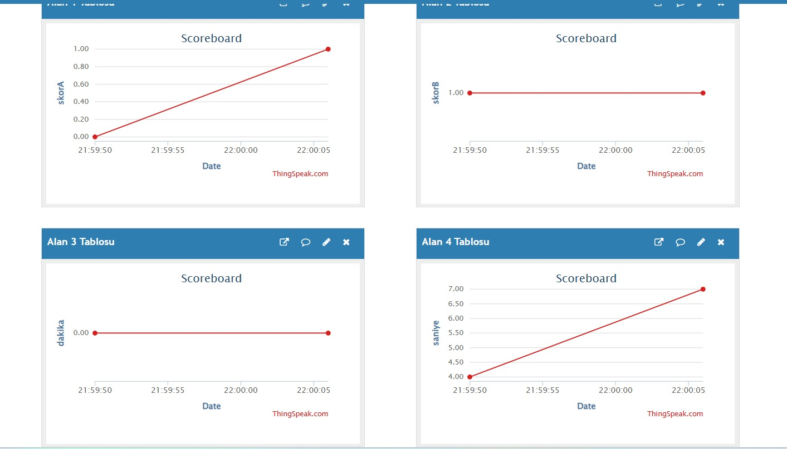

# 🏟️ STM32 IoT-Based Smart Scoreboard Project

This project is a comprehensive embedded system developed using the **STM32G030C8T6 (DemeDU Kit)**. It tracks match duration and scores, monitors environmental lighting, and streams real-time data to the **ThingSpeak** cloud platform.

---

## 🚀 Key Features

* **High-Precision Stopwatch:** Utilizes `Timer3` interrupts for millisecond-accurate match timing across two halves.
* **Smart Stadium Lighting:** Autonomous lighting control via `ADC` (LDR sensor) that activates LEDs when ambient light drops below a threshold.
* **Interactive UI:** 3x user buttons configured with `EXTI` interrupts for Match Start/Pause, Team Selection, and Score Management.
* **Audio-Visual Feedback:**
    * Specialized "Goal Sound" frequency.
    * Referee whistle simulation at the end of the match.
    * RGB LED animation sequences for match starts and ends.
* **IoT Connectivity:** Asynchronous data streaming of scores and time to ThingSpeak via `UART` communication.

---

## 🛠️ Hardware Architecture

* **MCU:** STM32G030C8T6 (ARM® Cortex®-M0+)
* **Connectivity:** ESP8266 WiFi Module & USB-to-TTL Bridge
* **Sensors:** LDR (Light Dependent Resistor - ADC Channel 5)
* **Outputs:** Buzzer, RGB LED, and status indication LEDs
* **Inputs:** 3x Push Buttons (Pull-up configuration)

---

## 📡 IoT & Cloud Data Workflow

The system uses a hybrid hardware configuration for cloud integration:

1. **Data Packaging:** STM32 packages live data as `A:score,B:score,D:min,S:sec`.
2. **Communication Bridge:** Data is routed through on-board jumpers to the ESP8266 module via UART.
3. **Cloud Streaming:** The ESP8266 (running Arduino firmware) connects to a local hotspot and pushes data to the ThingSpeak API.

  
   
  <i>Figure 1: Real-time data tracking and score analysis panel on ThingSpeak</i>

---

## 💻 Software Implementation

Developed in **STM32CubeIDE** using **HAL** libraries.

* **Interrupt Management:** Synchronized execution of debounce-protected GPIO interrupts and periodic timer callbacks.
* **Power Efficiency:** Automatic transition of peripherals (LEDs/Buzzer) to low-power states when the match is paused or finished.

---

## 🔧 Setup & Usage

1. **Flash Firmware:** Upload the project to the MCU via the Debugger port.
2. **Jumper Configuration:** Set jumpers to route UART communication to the ESP module.
3. **Network Setup:** Ensure the ESP8266 is configured to connect to your mobile hotspot.
4. **Monitoring:** View live match statistics on your designated ThingSpeak channel.

---

**Developer:** Yunus Kunduz  
**YouTube Channel:** [CozumLab](https://www.youtube.com/@CozumLabTR)
